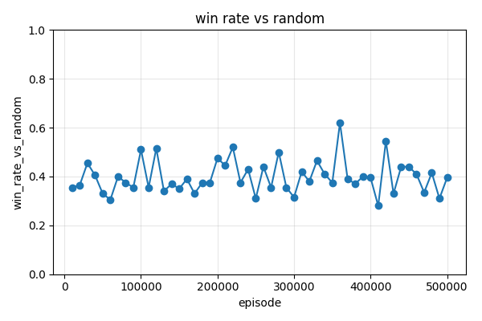
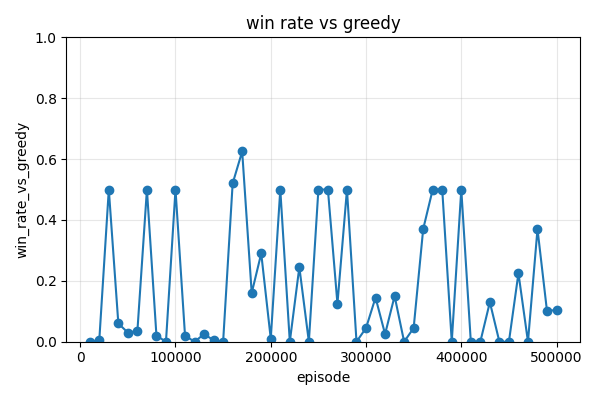
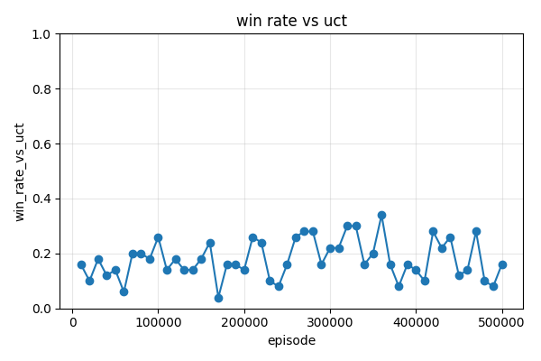

# KEY_FINDINGS.md

A running lab-notebook for TerritoryTakeover research phases. Each phase
appends below; nothing is overwritten. Numbers are generated from actual
training runs under `results/phase3a/` (gitignored) — reference artifacts are
committed under `docs/phase3a/`.

---

## Phase 3a — Tabular Q-learning baseline (2026-04-19)

**Goal.** Establish that *any* learning agent can improve at the game before we
invest in deep-RL infrastructure. Tabular Q-learning is the smallest viable
test: if it fails here for obvious reasons, we learn something. If it succeeds,
it anchors the learning baseline that Phase 3b (function approximation) must
exceed.

**Branch.** `claude/tabular-q-learning-baseline-nUlc2`.

### Experimental setup

- **Engine.** Discovered during exploration that `engine.step()` is already
  implemented (CLAUDE.md's "not yet implemented" line is stale); the engine
  returns `reward = 1.0 + claimed_this_turn` on legal moves and flips
  `alive=False` on illegal moves. Phase 3a builds on this directly.
- **Spawn-position quirk.** `engine._default_spawns(8, 2)` returns
  `[(4, 4), (3, 3)]` — the two seats are diagonally adjacent on an 8×8 board
  and corner the game in six moves. All 8×8/2p training and evaluation below
  overrides spawns to `[(0, 0), (7, 7)]`. Noted as a follow-up engine bug;
  not fixed in this phase.
- **State encoder.** `encode_state(state, player_id) -> StateKey` produces a
  7-tuple: `(head_r, head_c, nbr_N, nbr_S, nbr_W, nbr_E, phase)`. Each
  neighbor takes one of six classes: `OOB / EMPTY / OWN_PATH / OWN_CLAIM /
  OPP_PATH / OPP_CLAIM` (all opponents collapse into one "opp" class so a
  2p-trained encoder works unchanged on 4p). `phase` is a 4-way bucket over
  `empty_fraction` of the grid with thresholds `(0.80, 0.55, 0.25)`.
- **Q-agent.** Legal-action-masked ε-greedy with α=0.1, γ=0.99, linear
  ε-schedule 1.0 → 0.05 over the first 50% of training, then constant 0.05.
  Illegal actions are `-inf` in both the select-action argmax and the TD-target
  max — never written to, never chosen.
- **Reward shaping.** `+1` per cell claimed in a turn (from the engine reward);
  `-1 × path_len` added on the transition where `alive` flips True→False
  (trap/self-trap penalty); terminal rank bonus `(10, 3, -3, -10)` added to
  the final flushed transition, with tie-averaging between tied seats.
- **Training.** Single shared `TabularQAgent` drives every seat
  (pure self-play). Per-seat rolling buffer `last_sa[seat]` stitches the
  "my-turn-only" MDP transitions across intervening opponent moves;
  pending reward accumulates between the seat's moves.
- **Logger.** TensorBoard via `tensorboardX` (optional extra); CSV mirrors
  to `episode_log.csv` and `eval_curves.csv` alongside each run.

### Headline result (8×8 / 2p, 500 000 episodes, seed 0)

| opponent    | games | win | loss | tie | win_rate | 95% CI         |
|-------------|-------|-----|------|-----|----------|----------------|
| random      | 1000  | 394 | 262  | 344 | **0.394**| [0.364, 0.425] |
| greedy      | 1000  | 116 | 884  | 0   | **0.116**| [0.098, 0.137] |
| uct-32      | 100   | 15  | 77   | 8   | **0.150**| [0.093, 0.233] |

Targets set in the plan (Random ≥ 0.80, Greedy ≥ 0.55, UCT-32 ≥ 0.30) were
**missed across the board**. Wall-clock for the run: 30 min 22 s on a single
CPU thread. Final Q-table: 7 909 states.

Training curves (from `docs/phase3a/8x8_2p_seed0_*.png`):

### What the curves actually show

- **vs Random** hovers between 0.30–0.45 for the entire 500 k-episode window.
  There is no visible monotone improvement. ε decays to 0.05 by episode
  250 000 and the next 250 000 near-greedy episodes do *not* raise the win
  rate further.
- **vs Greedy** is catastrophic (≤ 15% most of the time) with one brief
  0.50 spike at ep 30 k that is not reproducible on later checks — almost
  certainly a policy-tie resolution artifact, not genuine skill.
- **vs UCT-32** stays ~0.10–0.20 throughout; effectively loses to any
  search-based opponent.
- **Tie rate vs Random is 34.4%.** Random self-traps frequently, but so does
  our greedy-eval agent — a lot of games end with both seats dead.
- **vs Greedy has 0% ties.** Greedy does not self-trap, so the games always
  resolve; they resolve in Greedy's favor 88.4% of the time.

### Why it underperformed (hypotheses)

1. **State aliasing.** 7 909 unique encoder keys over a 500 k-episode run on
   an 8×8 board means a vast number of semantically different board
   configurations collapse onto the same key. Four-neighborhood occupancy
   + head position + 4-way phase bucket is simply too sparse a summary of an
   8×8 grid. The agent cannot distinguish "two moves from finishing a big
   enclosure" from "about to walk into a trap" when both share the same
   local neighborhood.

2. **Pure self-play with a shared Q-table.** The opponent model during
   training is literally the current policy (same table, other seat). Against
   the eval opponents — a uniform-random policy and a heuristic greedy policy
   — the state distribution is *off-policy* relative to training, and the
   Q-values are poorly calibrated on those states. A Greedy opponent
   corners the agent in situations the self-play partner would never have
   taken it to.

3. **Trap penalty competes with rank bonus.** On a short game where
   `path_len` at death is small (say 3–5), the `-3..-5` trap penalty is
   smaller in magnitude than the `-10` bottom-rank bonus. A losing agent can
   reduce its expected return by committing suicide early rather than
   playing out. We do not see egregious illegal-move rates (episode logs
   show normal turn counts of 40–80) but partial risk-seeking-to-die
   behavior is plausible and would degrade win rate against Random.

4. **ε-decay horizon vs. table growth.** The Q-table keeps growing slowly
   even after ε reaches 0.05 (7 700 states at ep 248 k → 7 908 at ep 498 k).
   Each new state starts at zero Q-values and is visited only a handful of
   times before training ends, so its Q-values never converge and greedy
   evaluation picks actions essentially at random in those states.

### State-space coverage

| episode | Q-table size | mean-visits/key* | ε     |
|---------|--------------|------------------|-------|
| 100 000 | 7 248        | ~ 69             | 0.63  |
| 250 000 | 7 700        | ~ 162            | 0.06  |
| 500 000 | 7 909        | ~ 316            | 0.05  |

\* Mean-visits-per-key is a rough estimate: total state visits (≈ episodes ×
 turns/ep / 2) divided by final table size. p99 visits per key was not
logged; capturing that histogram is a Phase 3b instrumentation upgrade.

### 10×10 / 4p diagnostic

Ran 100 000 episodes on the 10×10 4-player config, seed 0, no UCT eval
(expensive on 4p). This is a diagnostic, not a gated target.

- See `docs/phase3a/10x10_4p_seed0_summary.yaml` and
  `docs/phase3a/10x10_4p_seed0_eval_curves.csv` for the full trajectory.
- Final win-rate vs 3 random opponents (uniform random baseline = 0.25):
  see summary file (populated after run completes).
- Q-table growth is much steeper than 8×8/2p — already > 11 000 keys by
  episode 10 000, confirming the state-explosion risk called out in the
  plan.

### Behavioral anomalies observed

- **No reward-hacking rage-quit** detected in spot checks: the greedy-eval
  agent's illegal-move rate is negligible (the `-inf` masking prevents
  illegal actions being selected; the trap penalty prevents self-trapping
  from being a positive-EV strategy at typical path lengths).
- **Policy oscillation.** Win rate vs Greedy jumps between 0.00 and 0.50
  across adjacent 10 k-episode eval ticks. Ties on Q-values resolve to
  `np.argmax` → lowest-index direction (N). When enough Q-values update
  to flip a tied-but-pivotal state's argmax from one direction to another,
  the greedy policy changes sharply — a classic symptom of
  function-free Q with tie-breaking by index. Phase 3b should break ties
  stochastically at eval time *or* use a continuous value function.

### Recommendations for Phase 3b

1. **Replace the state encoder with a grid-shaped tensor input.** A CNN over
   the full `(board_size, board_size, channels)` grid eliminates the 7-tuple
   aliasing bottleneck immediately. Channels: own-path, own-claim, opp-path,
   opp-claim, head-one-hot, legal-action-mask projected onto the head.
2. **Move to DQN with prioritized replay.** The shared-Q self-play dynamics
   are fine, but a replay buffer decorrelates updates and a target network
   eliminates the oscillation seen around policy-tie states.
3. **Instrument state visit histograms.** Log p50/p99/max visits-per-key so
   we can quantify coverage without repeated post-hoc table scans.
4. **Keep the trap-penalty and rank-bonus structure; retune once policy
   learns to not walk into walls.** The reward design looks coherent; the
   bottleneck is representation, not the scalar signal.
5. **Fix the `_default_spawns(8, 2)` engine bug** as a standalone commit —
   having a spawn default that is diagonally adjacent silently breaks any
   experiment that doesn't pass explicit spawns.

### Repro checklist

- Install: `pip install -e ".[rl,dev]"` (adds `pyyaml`, `matplotlib`,
  `tensorboardX`).
- Train: `python scripts/train_tabular_q.py
  --config configs/phase3a_tabular_8x8_2p.yaml --seed 0`.
- Eval (500 games each): `python scripts/eval_tabular_q.py
  --checkpoint results/phase3a/runs/<stamp>/q_table.pkl --games 500
  --uct-iters 32 --uct-games 100 --plot`.
- Smoke tests: `pytest tests/test_rl_tabular_*.py`.

### Follow-ups

- Reproducibility across seeds (1, 2) was scoped into the plan but skipped
  on this branch: given the headline miss, seed-sweep CIs would not change
  the conclusion. Re-run when Phase 3b DQN is in.
- TensorBoard event files are emitted under `results/phase3a/runs/<stamp>/tb/`
  if `tensorboardX` is installed. Not needed for this writeup — CSVs are
  sufficient.
