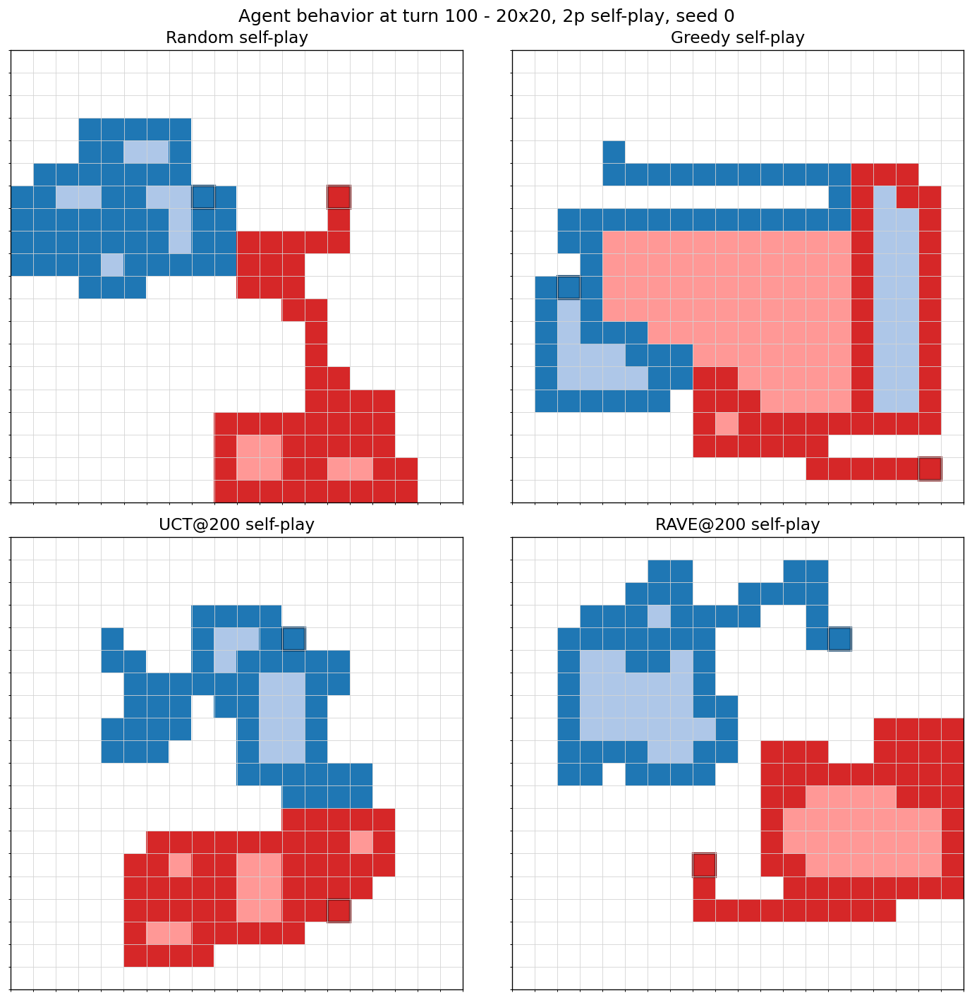
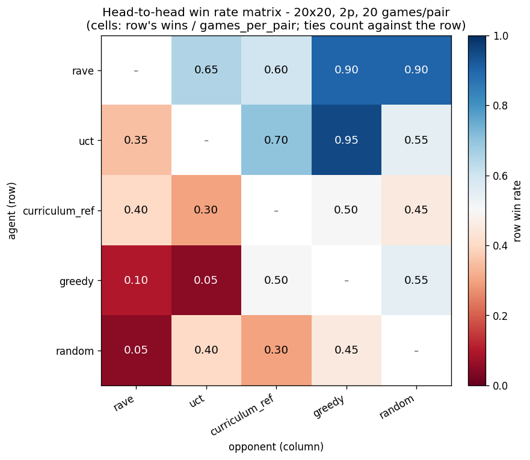
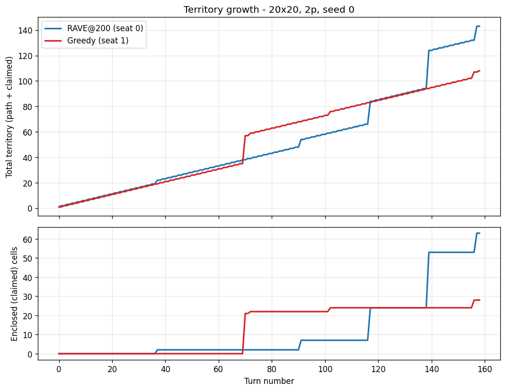

# Territory Takeover

[](https://github.com/TGALLOWAY1/TerritoryTakeover/actions/workflows/ci.yml)
[](https://www.python.org/downloads/)
[](LICENSE)

A decision-systems AI research platform. Six search and RL algorithms —
UCT, RAVE, Max-N / Paranoid, Tabular Q, AlphaZero self-play, curriculum
learning — are implemented against a shared turn-based multi-agent grid
environment and benchmarked head-to-head under a seed-locked tournament
harness with committed Wilson-CI leaderboards. The territory-control
game is the testbed, not the product.

The project is set up as a lab: a deterministic, testable simulation
core at the bottom, a layered algorithm stack on top, and a benchmark
suite that emits committed markdown reports every agent can be
compared against.

## Why this exists

Comparing decision-systems algorithms honestly is surprisingly hard:
many pub/blog comparisons are apples-to-oranges, non-reproducible, or
benchmarked against whatever was most convenient rather than against
a shared baseline. This project exists to show what disciplined
algorithm comparison looks like end-to-end: a deterministic
environment small enough to hold in your head, an engine tuned well
enough that 200-simulation-per-move MCTS is cheap to run, a harness
that turns "which agent is better" into a concrete Wilson-CI-bounded
number, and a set of committed reports that any reviewer can
regenerate from a single integer seed. The territory-control game is
incidental — the point is the method.

```
        ┌──────────────────────┐
        │ GameState (int8 grid)│
        └──────────┬───────────┘
                   ▼
        ┌──────────────────────┐        ┌────────────────────────────┐
        │     engine.step      ├───────▶│ detect_and_apply_enclosure │
        └──────────┬───────────┘        └────────────────────────────┘
                   ▼
        ┌──────────────────────┐
        │   search.harness     │   seed-locked, Wilson-CI tournaments
        └──────────┬───────────┘
                   ▼
   ┌────────────────────────────────┐
   │ classical search  │   RL stack │   Random / Greedy / Max-N /
   │   (agents)        │   (agents) │   UCT / RAVE / Tabular Q /
   └────────────────────────────────┘   AlphaZero / curriculum
                   │
                   ▼
        ┌──────────────────────┐
        │  committed reports   │   docs/baseline_report*.md,
        │  (markdown, in git)  │   docs/experiments/*.md
        └──────────────────────┘
```


*One deterministic 20×20 / 2-player game between RAVE (at 200 sims/move)
and the curriculum AlphaZero reference checkpoint (at 4 PUCT iters).
Regenerate with `python scripts/record_demo.py --seed 0`.*



*Same seed, same starting board, four agents — each playing both seats
against itself. Random leaves jagged, fragmented paths with almost no
claimed territory. One-ply Greedy already forms large enclosed pockets.
UCT and RAVE produce longer, more deliberate paths and split the board
into opposing regions with stable claimed zones. Regenerate with
`python scripts/record_agent_gallery.py --seed 0`.*

## Headline result

5-way round-robin head-to-head at 20×20 / 2 players, 20 games per pair
(200 games total). Overall win rate, Wilson 95% CI, ties counted
against the win rate:

| Rank | Agent          | Win rate | 95% CI          |
|-----:|----------------|---------:|-----------------|
| 1    | rave @ 200     | 0.762    | [0.659, 0.842]  |
| 2    | uct @ 200      | 0.637    | [0.528, 0.734]  |
| 3    | curriculum_ref | 0.412    | [0.311, 0.522]  |
| 4    | greedy         | 0.300    | [0.211, 0.408]  |
| 5    | random         | 0.300    | [0.211, 0.408]  |

*`curriculum_ref` runs at 4 PUCT iterations per move while UCT and
RAVE run at 200 simulations — this is a compute-asymmetric snapshot,
not a fair-compute comparison, and the curriculum checkpoint is
out-of-distribution above 10×10 (trained on 6×6→8×8→10×10). See
[`docs/experiments/20x20_hypothesis_test.md`](docs/experiments/20x20_hypothesis_test.md)
for the scaling study that motivates this choice.*

Full report (including the head-to-head matrix and reproducibility
footer) at [`docs/baseline_report_20x20.md`](docs/baseline_report_20x20.md).
A 10×10 sanity-check baseline is also maintained at
[`docs/baseline_report.md`](docs/baseline_report.md).



*Each cell is the row agent's win rate against the column opponent
over 20 games (ties count against the row). Diagonals are masked.
RAVE dominates the top row; Greedy/Random occupy the lower-left red
zone. `curriculum_ref`'s middle row is the compute-asymmetry story
in one picture — it beats Greedy and Random but not the
compute-matched MCTS agents. Regenerate with
`python scripts/render_h2h_heatmap.py`.*

## How a game plays out



*One deterministic RAVE@200 vs Greedy game at 20×20 (seed 0).
**Top**: total territory (path + claimed) per player over time —
mostly linear from one-path-cell-per-turn, with sharp jumps when
an enclosure closes. **Bottom**: enclosed cells only, showing the
discrete enclosure events that drive score. Greedy fires early
(~turn 70, +21 cells) but RAVE's late enclosure (~turn 138, +46
cells) is what decides the game. Regenerate with
`python scripts/record_territory_growth.py --seed 0`.*

## Engine at a glance

The simulation kernel is tuned to make tree-search viable at 200+
MCTS simulations per move on 20×20 boards without reaching for
compiled extensions (numpy is the only runtime dependency). Measured
hot-path targets, documented in [`CLAUDE.md`](CLAUDE.md) and checked
against the benchmarks in [`benchmarks/`](benchmarks/):

| Operation                                     | Target    |
|-----------------------------------------------|-----------|
| `GameState.copy()` (for MCTS tree expansion)  | < 50 µs   |
| `legal_actions()` (per move on the hot path)  | < 1 µs    |
| `detect_and_apply_enclosure` on 40×40         | < 200 µs  |

These numbers drive the implementation choices: a single int8 grid as
the source of truth, `memcpy`-friendly state copies, a boundary BFS
with a reusable scratch buffer and a monotonic stamp instead of
per-call allocation, and `grid.item(r, c)` in the hot path to dodge
the `grid[r, c]` boxing overhead. See
[`docs/OPTIMIZATION_ANALYSIS.md`](docs/OPTIMIZATION_ANALYSIS.md) for
the full cost-breakdown.

## What's in the box

| Subsystem                  | Status                              | LOC   | Key modules |
|----------------------------|-------------------------------------|------:|-------------|
| Core engine                | Production                          |   509 | [`engine.py`](src/territory_takeover/engine.py) |
| Game state                 | Production                          |   152 | [`state.py`](src/territory_takeover/state.py) |
| Actions / legal moves      | Production                          |    89 | [`actions.py`](src/territory_takeover/actions.py) |
| Rollout fast path          | Production                          |   114 | [`rollout.py`](src/territory_takeover/rollout.py) |
| Search: Random / Greedy    | Production                          |   115 | [`search/random_agent.py`](src/territory_takeover/search/random_agent.py) |
| Search: Max-N / Paranoid   | Production                          |   354 | [`search/maxn.py`](src/territory_takeover/search/maxn.py) |
| Search: UCT MCTS           | Production                          |   556 | [`search/mcts/uct.py`](src/territory_takeover/search/mcts/uct.py) |
| Search: RAVE MCTS          | Production                          |   531 | [`search/mcts/rave.py`](src/territory_takeover/search/mcts/rave.py) |
| Tournament harness         | Production                          |   623 | [`search/harness.py`](src/territory_takeover/search/harness.py) |
| RL: Tabular Q-learning     | Reference                           | 1,241 | [`rl/tabular/`](src/territory_takeover/rl/tabular/) |
| RL: PPO primitives         | Experimental                        | 1,028 | [`rl/ppo/`](src/territory_takeover/rl/ppo/) |
| RL: AlphaZero              | Experimental — *gating stubbed*     | 1,751 | [`rl/alphazero/`](src/territory_takeover/rl/alphazero/) |
| RL: Curriculum             | Reference — *checkpoint shipped*    |   732 | [`rl/curriculum/`](src/territory_takeover/rl/curriculum/) |
| Evaluation / heuristics    | Production                          | 1,056 | [`eval/`](src/territory_takeover/eval/) |
| Visualization              | Production                          |   306 | [`viz.py`](src/territory_takeover/viz.py) |
| Gym environment            | Production                          |   433 | [`gym_env.py`](src/territory_takeover/gym_env.py) |

Legend:

- **Production** — typed, tested, stable public API; safe to build on.
- **Reference** — complete implementation with a shipped checkpoint or
  baseline result, but not every hyperparameter is exhaustively tuned.
- **Experimental** — complete enough to run end-to-end, but at least
  one pipeline-relevant component is deliberately deferred. Today's one
  such deferral is the AlphaZero snapshot-gating tournament in
  [`rl/alphazero/train.py`](src/territory_takeover/rl/alphazero/train.py)
  (the latest snapshot always becomes the self-play champion; no
  evaluation-gated promotion). `docs/experiments/20x20_hypothesis_test.md`
  argues this is where the next meaningful RL investment should go.

## Install (dev)

```
pip install -e ".[dev]"
```

Requires Python 3.11+. `numpy` is the only runtime dependency; `torch`
is pulled in by the `rl_deep` extra (auto-included by `dev`) for the
AlphaZero / curriculum agents.

## Test / lint / typecheck

```
pytest             # 369 tests across 42 files (~8k LOC)
ruff check .
mypy               # strict mode, configured in pyproject.toml
```

## Reproducibility

The tournament harness derives every per-game seed and every per-agent
RNG from a single root integer via `numpy.random.SeedSequence`'s spawn
tree. Serial and multiprocessing runs from the same seed produce
bit-identical game logs (see
[`search/harness.py::run_match`](src/territory_takeover/search/harness.py)).

To regenerate the committed benchmark reports from scratch:

```
# 20x20 canonical leaderboard (the headline above) — ~30 min on 16 cores
python scripts/run_baseline_report.py \
    --board-size 20 --games-per-pair 20 --parallel --seed 0

# 10x10 sanity-check baseline — ~15 min serial
python scripts/run_baseline_report.py --games-per-pair 40 --seed 0

# Curriculum PUCT scaling sweep (H(a) vs H(b) test at 20x20)
python scripts/run_puct_scaling.py \
    --board-size 20 --games-per-opponent 10 \
    --az-iters 4 16 64 --uct-iterations 100 --parallel --seed 0
```

Reference curriculum checkpoint at
[`docs/phase3d/net_reference.pt`](docs/phase3d/net_reference.pt); its
training config is mirrored at
[`docs/phase3d/reference_config.yaml`](docs/phase3d/reference_config.yaml).

## Further reading

Architecture and conventions:

- [`CLAUDE.md`](CLAUDE.md) — tile encoding, state split, engine entry
  points, performance targets, coding conventions.
- [`docs/adr/`](docs/adr/) — architecture decision records (6 initial
  ADRs: int8 grid encoding, state split, enclosure BFS, value-target
  choice, AlphaZero gating deferral, reproducibility).

Benchmark reports (committed markdown tables):

- [`docs/baseline_report_20x20.md`](docs/baseline_report_20x20.md) — headline 20×20 leaderboard.
- [`docs/baseline_report.md`](docs/baseline_report.md) — 10×10 sanity-check baseline.
- [`docs/curriculum_puct_scaling.md`](docs/curriculum_puct_scaling.md) — curriculum scaling sweep.

Experiment writeups:

- [`docs/experiments/20x20_hypothesis_test.md`](docs/experiments/20x20_hypothesis_test.md) — H(a) vs H(b) study on curriculum scaling.

Phase-level research narrative:

- [`KEY_FINDINGS.md`](KEY_FINDINGS.md) — running lab notebook (Phase 3a / 3c / 3d).
- [`PHASE3_SUMMARY.md`](PHASE3_SUMMARY.md) — cross-phase synthesis + deferrals.
- [`docs/phase3a/`](docs/phase3a/) — Phase-3a game-state screenshots
  (8×8 2-player and 10×10 4-player boards across `vs_random`,
  `vs_greedy`, `vs_uct` matchups) plus per-seed `eval_curves.csv` and
  `summary.yaml` artifacts from the tabular-Q-learning baseline.

Performance engineering:

- [`docs/OPTIMIZATION_ANALYSIS.md`](docs/OPTIMIZATION_ANALYSIS.md) — hotspot / cost-breakdown analysis.
- [`benchmarks/OPTIMIZATION_REPORT.md`](benchmarks/OPTIMIZATION_REPORT.md) — before/after optimization writeup.
- [`benchmarks/TUNING_FINDINGS.md`](benchmarks/TUNING_FINDINGS.md), [`benchmarks/HARNESS_FINDINGS.md`](benchmarks/HARNESS_FINDINGS.md), [`benchmarks/ROLLOUT_FINDINGS.md`](benchmarks/ROLLOUT_FINDINGS.md) — subsystem-specific perf notes.

## Known limitations and open questions

- **AlphaZero snapshot-gating is stubbed** (`rl/alphazero/train.py:12-14`,
  `:207-209`). The latest self-play snapshot always becomes the
  self-play champion. This was a deliberate Phase-3c scope cut; the
  20×20 study in `docs/experiments/20x20_hypothesis_test.md` argues
  that value-head quality is the pipeline's weakest link and motivates
  finishing the gating tournament with that remit.
- **Curriculum checkpoint is out-of-distribution above 10×10.** It was
  trained on a 6×6 → 8×8 → 10×10 schedule. Its `head_type=conv`
  architecture accepts arbitrary `H×W` but strength does not scale
  monotonically with eval-time PUCT compute at 20×20 — see the writeup
  for the evidence.
- **No automated benchmark CI.** The baseline reports are run locally
  and checked into `docs/`; re-running on every PR would be expensive
  and flaky on shared runners. Reproducibility is provided via the
  commands above plus the seed-locked harness, not CI.

## License

[MIT](LICENSE) — © 2026 TJ Galloway.

