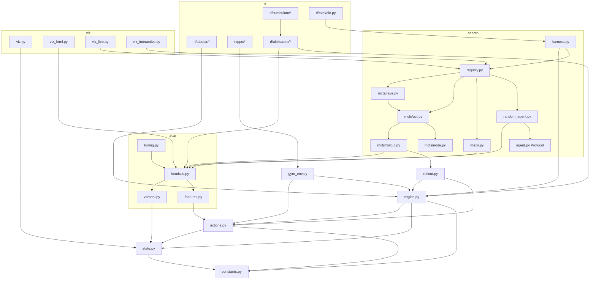

# System Map

> Module dependency map. Arrows mean "depends on / imports". Edges are simplified to the
> architecturally significant ones. Last audited 2026-05-28.

## Dependency graph

## Layering rules (read top-to-bottom = allowed dependency direction)

| Layer | Modules | May depend on |
|---|---|---|
| Core | `constants`, `state`, `actions`, `engine`, `rollout` | only core |
| Eval | `eval/*` | core |
| Agents | `search/*`, `rl/*`, `gym_env` | core, eval |
| Benchmark | `search/harness`, `rl/eval/elo` | core, eval, agents |
| Viz | `viz*` | any of the above (read-only views) |

No upward dependencies: the engine core knows nothing about agents, RL, or visualization.

## Hotspots (where most of the complexity/LOC lives)
- `viz_interactive.py` (~1075), `viz_live.py` (~699), `viz_html.py` (~672) — UI/HTTP surface area.
- `search/harness.py` (~623), `search/mcts/uct.py` (~556), `search/mcts/rave.py` (~531) — algorithm core.
- `rl/alphazero/*` (~1751 total) — the deepest RL track.

## Related docs
- [`ARCHITECTURE.md`](ARCHITECTURE.md) — layer responsibilities and runtime flow.
- [`docs/08-visuals/FLOW_DIAGRAMS.md`](../08-visuals/FLOW_DIAGRAMS.md) — sequence/flow Mermaid diagrams.
- [`docs/03-implementation/CODEBASE_INVENTORY.md`](../03-implementation/CODEBASE_INVENTORY.md) — per-module symbols + LOC.
