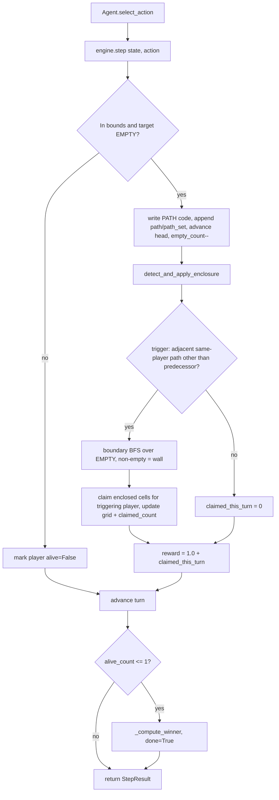
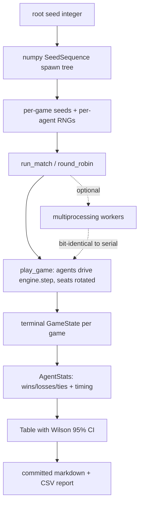
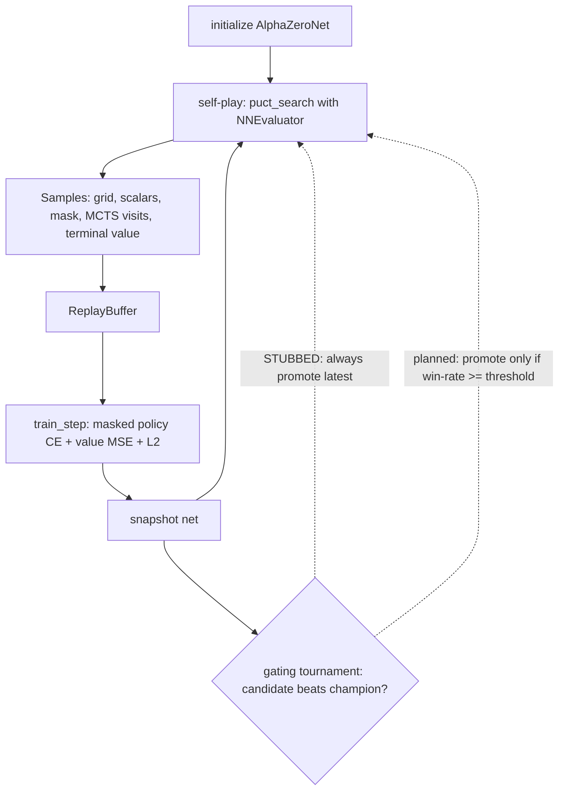

# Flow Diagrams

> Sequence/flow diagrams for the core runtime paths. Mermaid blocks render natively on GitHub and
> were validated during authoring. For the module dependency graph see
> [`docs/02-architecture/SYSTEM_MAP.md`](../02-architecture/SYSTEM_MAP.md). Last audited 2026-05-28.

## 1. Engine: one move (`step` + enclosure)

Source: `engine.py` (`step`, `detect_and_apply_enclosure`, `_advance_turn`, `_compute_winner`).

## 2. Tournament harness (seed-locked, reproducible)

Source: `search/harness.py`; reproducibility rationale in ADR-006.

## 3. AlphaZero self-play → training loop

Source: `rl/alphazero/{selfplay,train,mcts,evaluator,replay}.py`. The gating branch is the one
deliberate stub (`train.py:207-210`, ADR-005) — see
[`docs/04-quality/KNOWN_ISSUES.md`](../04-quality/KNOWN_ISSUES.md).

## Related docs
- [`docs/02-architecture/ARCHITECTURE.md`](../02-architecture/ARCHITECTURE.md) — prose runtime/data flow.
- [`SCREENSHOT_MANIFEST.md`](SCREENSHOT_MANIFEST.md) — rendered game artifacts.
